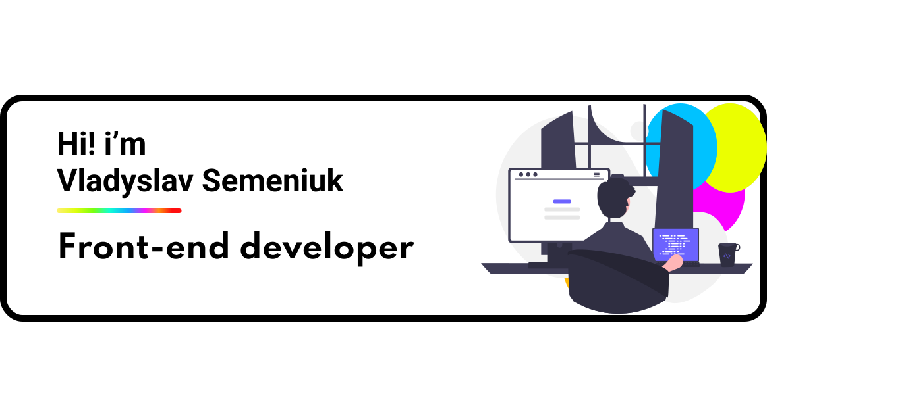

 

I`m Frontend Developer from Opole, :poland: :house:

## 🔥 Technologies

> General

<table width='100%'>
  <tr>
    <td align="center" width="110" height="90">
      
       JavaScript
    </td>
    <td align="center" width="110" height="90">
      
       TypeScript
    </td>
        <td align="center" width="110" height="90">
      
       HTML5
    </td>
         <td align="center" width="110" height="90"> 
      
       CSS3
    </td>
    <td align="center" width="110" height="90">
      
       Figma
    </td>
    <td align="center" width="110" height="90">
      
       git
    </td>
    <td align="center" width="110" height="90"> 
      
       npm
    </td>
     <td align="center" width="110" height="90"> 
      
       Github
    </td>
  </tr> 
</table>

> Testing

<table width='100%'>
  <tr>
     <td align="center" width="110" height="90"> 
      
       Jest
    </td>
    <td align="center" width="110" height="90"> 
      
       RT Library
    </td>
    <td align="center" width="110" height="90"> 
      
       Cypress
    </td>
    <td align="center" width="110" height="90"> 
      
       Playwright
    </td>
    <td align="center" width="110" height="90"> 
      
       Puppeteer
    </td>
    <td align="center" width="110" height="90"> 
      
       Checkly
    </td>
  </tr> 
</table>

> Code quality

<table width='100%'>
  <tr>
     <td align="center" width="110" height="90">
      
       eslint
    </td>
    <td align="center" width="110" height="90">
      
       prettier
    </td>
  </tr> 
</table>

> Frontend

<table width='100%'>
  <tr>
   <td align="center" width="110" height="90">
      
       React JS
    </td>
     <td align="center" width="110" height="90">
      
       Next JS
      <td align="center" width="110" height="90">
      
       Tailwind
    </td>
    </td>
    <td align="center" width="110" height="90">
      
       Redux
    </td>
    <td align="center" width="110" height="90"> 
      
       Webpack
    </td>
    <td align="center" width="110" height="90"> 
      
       Vite
    </td> 
    <td align="center" width="110" height="90">
      
       Sass
    </td>
    
  </tr> 
</table>

> Backend

<table width='100%'>
  <tr>
     <td align="center" width="110" height="90"> 
      
       Firebase
    </td>
      <td align="center" width="110" height="90"> 
      
       Prisma
    </td>
  </tr> 
</table>

## :envelope_with_arrow: Contact

- :briefcase: &nbsp;**[LinkedIn](https://www.linkedin.com/in/vladyslav-semeniuk/)**

 
